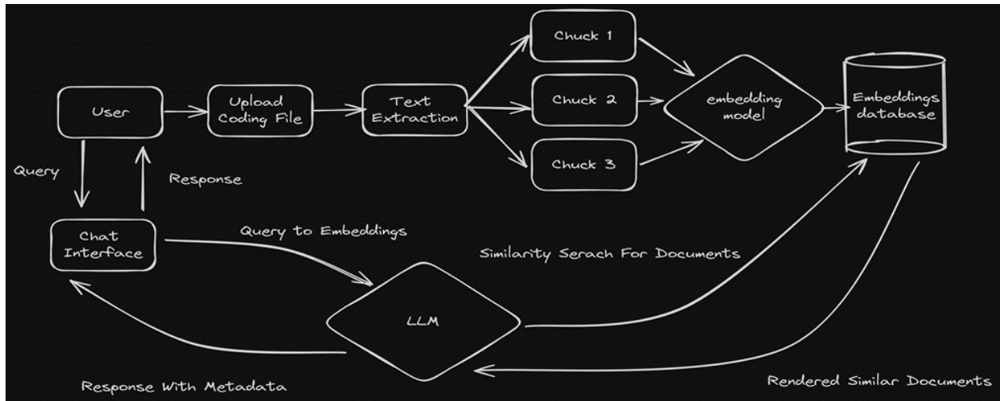

## Empowering Learners and Simplifying Academia with AI (EduChat Pro)

Problem Statement:
In the modern digital era, students face an overwhelming flood of data from textbooks, scholarly articles, and web sources. Sifting through this information overload to gain actionable insights is a daunting task. EduChat Pro tackles this issue head-on with an AI-driven platform that streamlines scholarly research and refines the essay composition process.
Context:
Harnessing advanced machine learning, natural language processing, and generative AI, this solution automates the once labor-intensive academic analysis workflow.
• Integrating AI and generative models boosts data interpretation and forecasting abilities.
• The system delivers enhanced analytics, greater precision, and optimized reporting workflows.
• Forecasting tools support forward-thinking decisions by anticipating shifts in academic performance trends.

# Objective:
EduChat Pro pursues two core goals:
Scholarly Research and Comprehension: EduChat Pro delivers precise, succinct responses, overviews, and clarifications customized to the learner's queries and the material in their uploaded files.
Custom Essay Assessment Framework: Educators can design and submit personalized grading frameworks to tailor essay reviews and align evaluations with course-specific standards.
How It Functions:
File Upload and Analysis: Users submit PDF files, and the platform extracts all textual data.
Vectorization and Intelligent Retrieval: The text undergoes processing to create embeddings, enabling a high-speed semantic search system (powered by FAISS) for quick access to pertinent sections.
Query Response Generation: Learner questions are analyzed, matched against the stored content, and synthesized into detailed replies via the OpenAI large language model.
Essay Assessment Framework:
• Framework Selection: Learners select from ready-made templates (e.g., IELTS, TOEFL) or import teacher-designed custom frameworks.
• Essay Review: The assessment engine evaluates the submission based on the chosen framework's standards.
• Insightful Feedback: Drawing from the evaluation, EduChat Pro generates targeted advice on the essay's strong points and improvement opportunities, pinpointing which standards were achieved or missed.
Essential Inputs: For this project, the following core elements are required:
• EduChat Pro
o Submit your PDF file to activate the interactive assistant.
• Essay Assessment Framework
o Select a standard template (IELTS/TOEFL) or upload a bespoke framework.
o The engine evaluates the learner's essay against the framework's benchmarks.

# Architecture: 

# Operational Workflow
Phase 1: Data Gathering
Upon file submission, EduChat Pro activates its core engine, which automatically parses the document to pull out all textual content and divides it into manageable, bite-sized segments for optimal handling.
Phase 2: Vector Embedding Creation
Here, the raw text is transformed into dense numerical vectors through cutting-edge algorithms. These vectors encode the underlying meaning and connections in the content, facilitating rapid and accurate information retrieval and examination.
Phase 3: Query Processing
With preparation complete, EduChat Pro leverages the OpenAI Large Language Model (LLM) to craft responses. The relevant context segments, combined with the user's query, are fed into the LLM to produce the most relevant and insightful reply possible.

# Product Demo:

# Product Summary
EduChat Pro marks a transformative advancement in utilizing AI to deliver a more dynamic and impactful educational journey, equipping learners with the tools to thrive in their scholarly endeavors.
Chat Scholar represents a significant step towards leveraging AI to create a more engaging and effective learning experience for students, empowering them to excel in their academic pursuits.